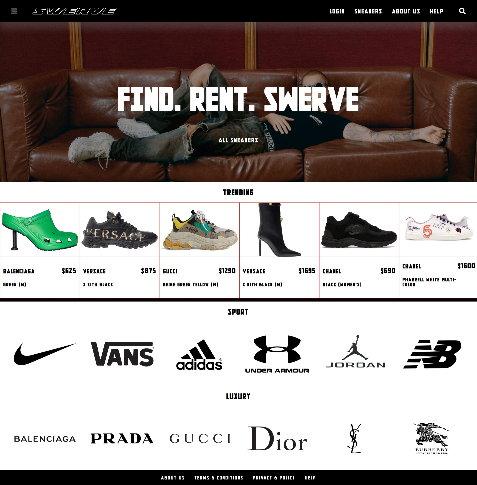
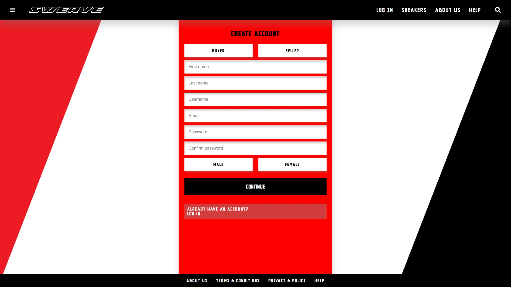
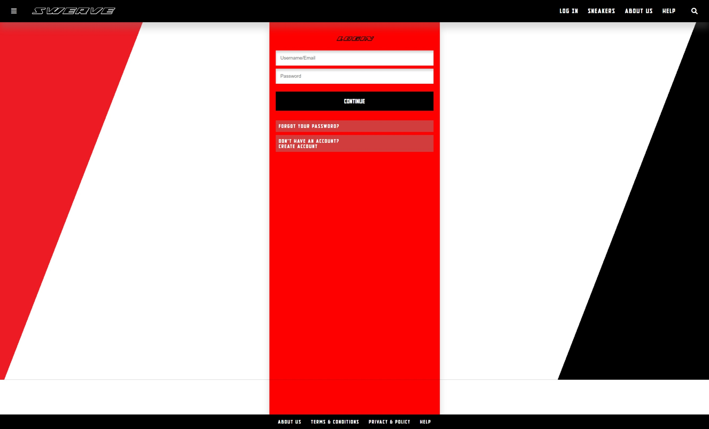
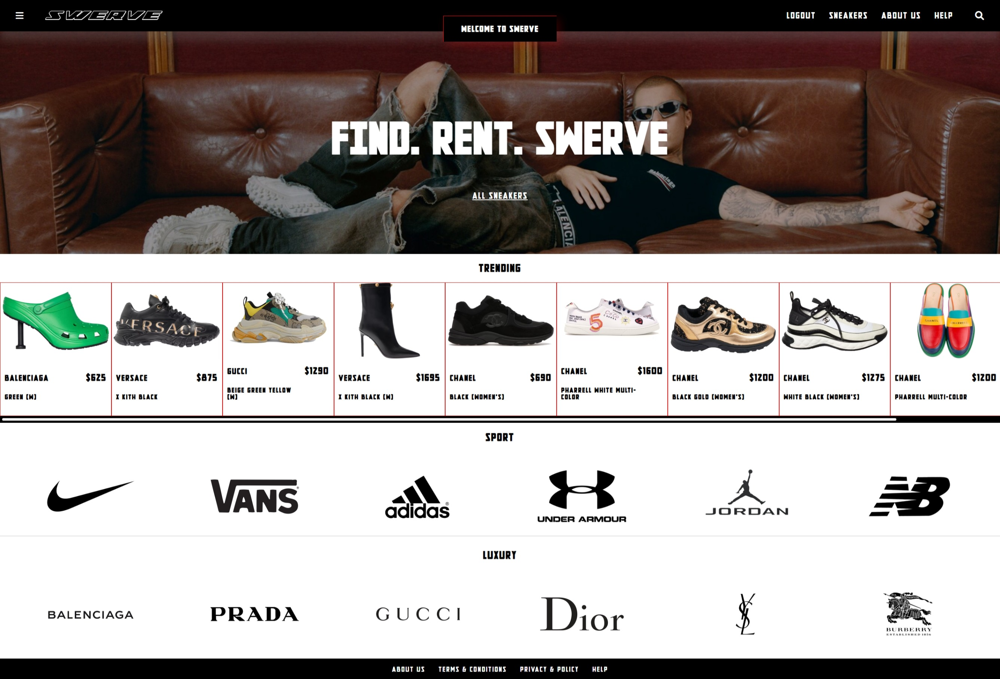
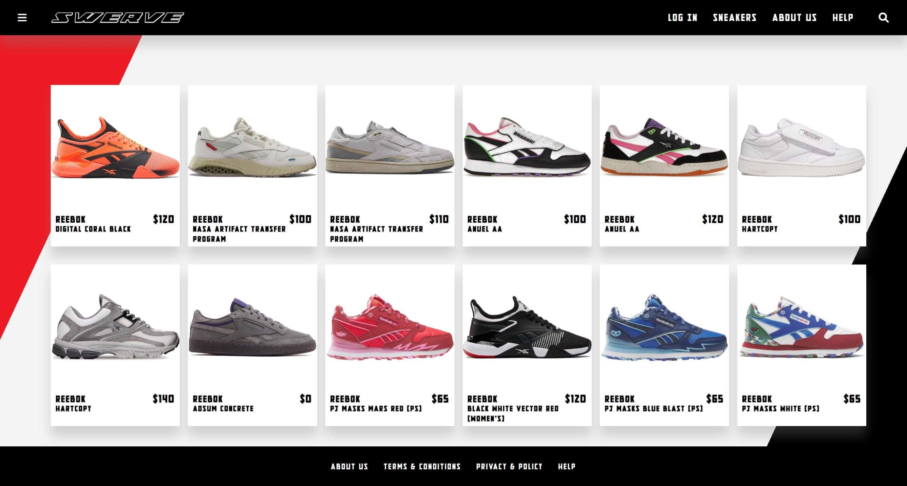
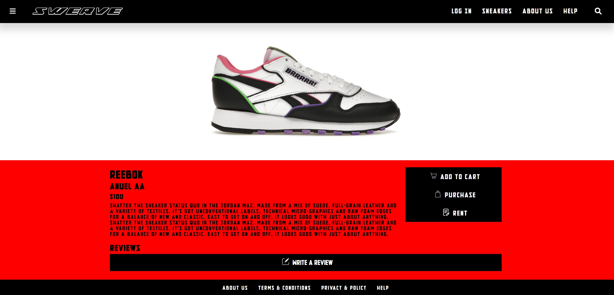

# SWERVE Sneakers

SWERVE Sneakers is a full-stack prototype for a sneaker rental marketplace. The project explores the idea of renting premium and trending sneakers rather than only buying or reselling them.

The application was built with HTML, CSS, JavaScript, PHP and MySQL. It includes a branded front end, sneaker browsing pages, external sneaker API integration, user signup, login, session-based navigation and logout functionality.

This repository has been cleaned and refactored to make it more suitable as a portfolio project, with improved authentication, local configuration, database setup and documentation.

---

## Project Overview

SWERVE was created as a fashion-tech web application prototype for users who want to browse premium sneakers and explore a rental-focused sneaker marketplace experience.

The project is not a production ecommerce platform, but it demonstrates a complete student-built web application with front-end pages, backend PHP logic, MySQL authentication, API-based product browsing and session handling.

---

## Key Features

- Branded landing page for a sneaker rental marketplace concept
- Trending sneaker product cards
- Sneaker catalogue page using external sneaker API data
- Brand-based browsing for selected sneaker brands
- Product detail page for individual sneaker items
- Signup page connected to a local MySQL database
- Password hashing using PHP `password_hash()`
- Login verification using PHP `password_verify()`
- Prepared statement used in login query
- PHP session-based login state
- Logout flow using `logout.php`
- Local API configuration using `config/config.example.php`
- SQL schema included for local database setup
- Supporting pages including About, Help, Privacy Policy and Terms & Conditions

---

## Screenshots

### Homepage



Landing page showing the SWERVE sneaker rental concept, navigation, brand-focused design and trending product cards.

### Signup Page



Signup page connected to the local MySQL database, with server-side validation and hashed password storage.

### Login Page



Login page used to authenticate registered users through the PHP backend.

### Logged-In Session



Session-based navigation state where the homepage changes from Login to Welcome/Logout after successful authentication.

### Sneaker Catalogue



Sneaker browsing page showing product data retrieved through the sneaker API integration.

### Product Detail / Rental Flow



Product detail page supporting the rental-focused user journey.

---

## Tech Stack

| Area | Technology |
|---|---|
| Front end | HTML, CSS, JavaScript |
| Backend | PHP |
| Database | MySQL |
| Local server | XAMPP / Apache |
| API integration | External sneaker API |
| Version control | Git and GitHub |

---

## Security and Refactoring Improvements

This project was reviewed and cleaned to improve security, maintainability and portfolio presentation.

Key improvements include:

- Removed hardcoded API key from the source code
- Added `config/config.example.php` for safe local API setup
- Ignored local secret files such as `config/config.php`
- Removed unsafe backup and API dump files from the repository
- Replaced plain-text password storage with hashed password storage
- Updated login logic to use `password_verify()`
- Replaced unsafe login SQL with a prepared statement
- Added PHP session handling for logged-in state
- Added logout functionality
- Renamed the homepage from `index.html` to `index.php` so it can use PHP sessions
- Added `database/schema.sql` for local database setup
- Improved the homepage trending section so broken external product images do not leave empty product gaps

---

## Project Structure

```text
swerve-sneakers/
├── config/
│   └── config.example.php
├── css/
│   ├── img/
│   ├── misc/
│   └── *.css
├── database/
│   └── schema.sql
├── docs/
│   └── screenshots/
├── about.html
├── blog.html
├── cart.html
├── forgotpassword.php
├── function.js
├── help.html
├── index.php
├── login.js
├── login.php
├── logout.php
├── popular.html
├── privacypolicy.html
├── reviews.php
├── signup.js
├── signup.php
├── sneakers.php
├── sneakers-redirect.js
├── sneakers-redirect.php
├── termsconditions.html
├── userlogin.php
├── usersignup.php
├── .gitignore
└── README.md
```

---

## Database Setup

This project uses a local MySQL database.

The database schema is included in:

```text
database/schema.sql
```

To set it up locally:

1. Open XAMPP.
2. Start Apache and MySQL.
3. Open phpMyAdmin.
4. Import `database/schema.sql`.

The schema creates the required database and `users` table for signup and login testing.

The local database name expected by the PHP connection is:

```text
hs902_swerve_login
```

The `users` table stores passwords as hashes, not plain text.

---

## Local Configuration

The project uses a local config file for the sneaker API key.

Copy this file:

```text
config/config.example.php
```

Create a local file named:

```text
config/config.php
```

Then replace the placeholder API key with your own API key:

```php
<?php

return [
    'rapidapi_host' => 'v1-sneakers.p.rapidapi.com',
    'rapidapi_key' => 'your_rapidapi_key_here'
];
```

The real `config/config.php` file is ignored by Git and should not be committed.

---

## How to Run Locally

1. Clone the repository:

```bash
git clone https://github.com/hamzasalahuddin72/swerve-sneakers.git
```

2. Move the project into your XAMPP `htdocs` directory:

```text
C:\xampp\htdocs\swerve-sneakers
```

3. Start Apache and MySQL in XAMPP.

4. Import the database schema in phpMyAdmin:

```text
database/schema.sql
```

5. Create your local API config file:

```text
config/config.php
```

6. Open the project in your browser:

```text
http://localhost/swerve-sneakers/index.php
```

If your local folder name is different, update the browser URL to match your folder name.

---

## Main User Flow

1. User opens the homepage.
2. User browses trending sneakers or opens the sneaker catalogue.
3. User creates an account through the signup page.
4. Signup stores the user in MySQL with a hashed password.
5. User logs in using their username/email and password.
6. Login verifies the password hash and starts a PHP session.
7. The homepage updates to show the logged-in state.
8. User can log out using the Logout link.

---

## Authentication Flow

### Signup

The signup handler receives form data, validates user input and stores the password using:

```php
password_hash($password, PASSWORD_DEFAULT)
```

This means plain-text passwords are not stored in the database.

### Login

The login handler fetches the user by username or email using a prepared statement, then verifies the typed password using:

```php
password_verify($password, $user['password'])
```

After successful login, PHP session values are set and the homepage updates the navigation state.

### Logout

The logout page clears the current PHP session and redirects the user back to the homepage.

---

## What I Learned

Building and refactoring SWERVE helped me practise:

- Designing a branded web application concept
- Building a multi-page PHP web project
- Connecting PHP forms to a MySQL database
- Handling signup, login and logout flows
- Using password hashing and password verification
- Using prepared statements for safer database queries
- Managing local API credentials safely
- Integrating external sneaker data into a web interface
- Debugging broken external image URLs
- Improving a repository for portfolio presentation
- Documenting local setup for other developers

---

## Current Status

SWERVE is a cleaned and refactored full-stack prototype. It demonstrates a working PHP/MySQL authentication flow, session-based navigation, API-based sneaker browsing and a branded user interface.

It is suitable as a portfolio project to show full-stack web development, debugging, repository cleanup and security-focused refactoring.

---

## Future Improvements

Planned improvements include:

- Move repeated database connection logic into a reusable PHP connection file
- Improve folder structure by separating public assets, backend handlers and views
- Add stronger validation and clearer user feedback on signup/login forms
- Add persistent cart and rental booking functionality
- Add product availability, rental dates, deposits and return logic
- Add admin-side product and rental management
- Improve mobile responsiveness and accessibility
- Add a dedicated placeholder image system for missing API product images
- Improve UI consistency across all pages
- Add automated checks or tests for key authentication flows

---

## Portfolio Note

This project shows the process of taking an early prototype and improving it into a more secure, documented and employer-facing portfolio repository.

The refactoring work is part of the value of the project: it demonstrates not only building a web application, but also reviewing security issues, improving authentication, cleaning repository structure and documenting setup clearly for other developers.
